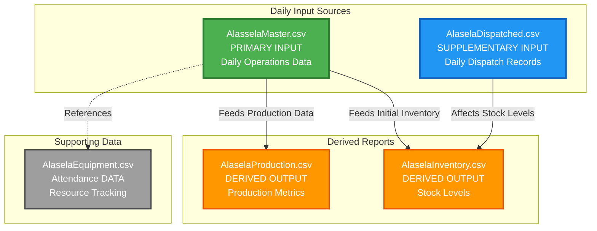
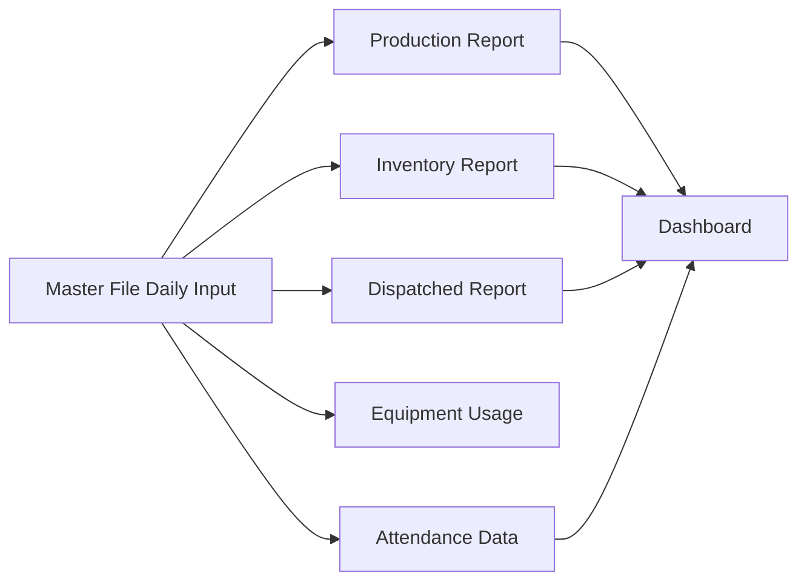

# Excel Data Analysis Report

## Comprehensive Data Structure Analysis and Database Design

---

## **Project Overview**

The objective of this project is to transform an Excel file ({file}.xlsx) into a web application that can perform the same mathematical calculations previously handled by Excel. The goal is to create a user-friendly interface that simplifies daily data entry.

To achieve this, the development will utilize Next.js, allowing for seamless data entry and the creation of a visually appealing dashboard. This dashboard will offer various export options, including Web app formats, Excel files, and Power BI reports.

Additionally, user authentication will be implemented using Simple NextAuth to ensure secure access to the application. Importantly, during the development process, all instances of npm will be replaced with bun, and all instances of npx will be replaced with bunx for improved performance and functionality.

### **Task**

Analyze the Excel spreadsheets
`docs/csv/AlaselaMaster.csv`
`docs/csv/AlaselaDispatched.csv`
`docs/csv/AlaselaEquipment.csv`
`docs/csv/AlaselaInventory.csv`

to understand data structure, identify patterns, and design a proper database schema for construction & demolition recycling facility operations management.

### **Current State Assessment**

The spreadsheet contains unstructured daily input logs that require transformation into a relational database system supporting both static dashboards (Excel & Power BI) and normalized data tables.

---

## **Data Source Information**

| **Property**       | **Details**                                   |
| ------------------ | --------------------------------------------- |
| **Site Scope**     | construction & demolition recycling facility          |
| **Data Type**      | Daily operational logs and reports            |
| **Current Format** | Unstructured Excel workbook                   |
| **Target Format**  | Relational database + Dashboard-ready exports |

---

## **CSV Data Flow Architecture**

### **Input Sources and Derived Outputs**

### **Data Relationship Summary**

| **File** | **Type** | **Function** | **Data Source** |
|----------|----------|--------------|-----------------|
| **AlasselaMaster.csv** | Primary Input | Daily operations staging | Manual daily entry |
| **AlaselaDispatched.csv** | Supplementary Input | Material outflow tracking | Manual daily entry |
| **AlaselaProduction.csv** | Derived Output | Production reporting | Calculated from Master |
| **AlaselaInventory.csv** | Derived Output | Stock management | Master (inflow) + Dispatched (outflow) |
| **AlaselaEquipment.csv** | Attendance Data | Equipment Operations Hours | Referenced by Master |

### **Data Flow Logic**

1. **Master → Production**: Production metrics are calculated from Master's processing records
2. **Master → Inventory**: New materials and processed stock are added from Master
3. **Dispatched → Inventory**: Outbound materials reduce inventory levels
4. **Master ↔ Equipment**: Master operations reference equipment availability

---

## **Sheet Structure Analysis**

### **1. Master File Sheet**

**Status**: `Unintelligent staging source` - requires restructuring

#### **Current Issues**

- ❌ **Description Column**: Does not contain descriptions; represents primary material types
- ❌ **Type Column**: Misleading label; contains operations/actions rather than types
- ❌ **Sub-Type Column**: Inconsistent data (equipment/operations/manpower)
- ❌ **Production Rows**: Different formulas creating data inconsistency

#### **Data Flow Purpose**

### **2. Dispatched Report Sheet**

**Purpose**: Material transaction documentation

| **Function**     | **Records**                |
| ---------------- | -------------------------- |
| Material Outflow | Dispatched quantities      |
| Transaction Log  | Material volume tracking   |
| Delivery Records | Distribution documentation |

### **3. Number of Equipment Sheet**

**Purpose**: Resource attendance tracking

| **Function**         | **Records**                  |
| -------------------- | ---------------------------- |
| Equipment Status     | Daily equipment availability |
| Workforce Attendance | Personnel tracking           |

### **4. Production Report Sheet**

**Purpose**: Daily crusher output data

| **Function**        | **Records**                 |
| ------------------- | --------------------------- |
| Daily Production    | Crusher output quantities   |
| Material Processing | Production by material type |
| Operational Metrics | Performance indicators      |

### **5. Inventory Report Sheet**

**Purpose**: Material stock management

| **Function**        | **Records**              |
| ------------------- | ------------------------ |
| Available Materials | Current stock levels     |
| Produced Materials  | New production inventory |
| Recycled Materials  | Reprocessed stock        |

---

## **Material Classification System**

### **Aggregate Material Types**

The current naming convention shows size variations of the same base material:

#### **Aggregate Sizes**

| **Size Designation** | **Measurement** | **Usage**          |
| -------------------- | --------------- | ------------------ |
| Aggregate 3/4        | 3/4 inch        | Standard aggregate |
| Zero 3/16            | 3/16 inch       | Fine aggregate     |
| Micro 1/16           | 1/16 inch       | Micro aggregate    |

#### **Distinct Material Types**

- **Aggregate** (various sizes)
- **Subbase** (foundation material)
- **Sand** (fine material)
- **[Other materials to be identified]**

>Need to standardize material taxonomy for database normalization. and reanalyze material types.

---

## **Database Design Requirements**

### **Step 0: Foundation Analysis**

#### **Primary Objectives**

1. **Extract Daily Input Patterns**: Understand how Master File data flows
2. **Identify Data Relationships**: Map connections between sheets
3. **Standardize Material Classification**: Create consistent material taxonomy
4. **Design Relational Schema**: Establish normalized database structure

#### **Target Outputs**

1. **Clean Master Sheet**: Dashboard-ready static export
2. **Normalized Data Tables**: Proper relational structure
3. **Data Integration Logic**: Automated flow between systems

---

## **Analysis Methodology**

### **Phase 1: Data Discovery**

- [ ] **Sheet Content Analysis**: Define columns and sample rows for each sheet
- [ ] **Data Type Identification**: Categorize field types and formats
- [ ] **Relationship Mapping**: Identify data dependencies
- [ ] **Quality Assessment**: Document data inconsistencies

### **Phase 2: Schema Design**

- [ ] **Entity Identification**: Define core business entities
- [ ] **Relationship Definition**: Establish entity relationships
- [ ] **Normalization Process**: Apply database normalization rules
- [ ] **Constraint Specification**: Define data validation rules

### **Phase 3: Implementation Planning**

- [ ] **Dashboard Requirements**: Specify reporting needs
- [ ] **Integration Points**: Define system interfaces
- [ ] **Validation Framework**: Establish data quality checks

---

## **Data Quality Issues Identified**

### **Critical Problems**

| **Issue**                       | **Impact**             | **Priority** |
| ------------------------------- | ---------------------- | ------------ |
| Inconsistent column semantics   | Data misinterpretation | HIGH         |
| Variable formula patterns       | Calculation errors     | HIGH         |
| Mixed data types in columns     | Processing failures    | HIGH         |
| Unclear material classification | Inventory confusion    | MEDIUM       |

### **Recommended Solutions**

1. **Column Renaming**: Align names with actual data content
2. **Data Type Standardization**: Enforce consistent formats
3. **Material Taxonomy**: Create standardized classification
4. **Formula Standardization**: Implement consistent calculations

---

## **Next Steps**

### **Immediate Actions Required**

1. **Access Excel File**: Open and examine ``docs/csv/**.csv``
2. **Sheet Documentation**: Record detailed structure for each sheet
3. **Sample Data Extraction**: Capture representative data samples
4. **Pattern Analysis**: Identify data flow patterns

### **Success Criteria**

- [ ] Complete understanding of current data structure
- [ ] Documented relationships between sheets
- [ ] Standardized material classification system
- [ ] Database schema design ready for implementation

---

## **Technical Specifications**

### **Tools and Technologies**

- **Analysis Tools**: Excel, Python pandas, SQL
- **Database Target**: Relational database (PostgreSQL/SQL Server)
- **Dashboard Platform**: Power BI, Excel pivot tables
- **Data Processing**: ETL pipeline for automation

### **Performance Requirements**

- **Daily Processing**: Automated data ingestion
- **Real-time Reporting**: Dashboard refresh capabilities
- **Data Integrity**: Validation and error handling
- **Scalability**: Support for multiple sites (future)

---

## **Deliverable**

### **Phase 1: Analysis Artifacts**

| **Artifact** | **Format** | **Content** |
|--------------|-----------|-------------|
| Data Structure Documentation | Markdown | Complete field definitions for all sheets |
| Material Taxonomy | CSV | Standardized material classification table |
| Data Relationship Diagram | Mermaid/ERD | Entity relationships and data flows |
| Quality Assessment Report | Markdown | Documented data inconsistencies and issues |

### **Phase 2: Database Design**

| **Artifact** | **Format** | **Content** |
|--------------|-----------|-------------|
| Entity-Relationship Diagram | ERD | Normalized database schema design |
| SQL Schema Scripts | SQL | Table creation and constraint definitions |
| Data Dictionary | Markdown | Complete field specifications per table |

### **Phase 3: Implementation Assets**

| **Artifact** | **Format** | **Content** |
|--------------|-----------|-------------|
| ETL Pipeline Scripts | TypeScript/Python | Data extraction and transformation logic |
| API Endpoint Documentation | Markdown | `/api/[module]/[resource]` specifications |
| Dashboard Templates | Power BI/Excel | Report layouts and data connections |
| Test Data Set | CSV | Sample data for validation testing |

### **Phase 4: Application Delivery**

| **Artifact** | **Format** | **Content** |
|--------------|-----------|-------------|
| Next.js Web Application | TypeScript | Data entry interface and dashboard |
| Authentication Module | NextAuth | User access control implementation |
| Database Instance | PostgreSQL | Deployed relational database |
| Deployment Documentation | Markdown | Setup and configuration instructions |

### **Delivery**

| **Phase** | **Milestone** |
|-----------|-------------|---------------|
| Phase 1 | Analysis complete, schema designed |
| Phase 2 | Database created |
| Phase 3 | Application developed, dashboards operational |
| Phase 4 |  Production deployment, user training |

### **Acceptance Criteria**

- Docs

  - [ ] All CSV files analyzed and documented
  - [ ] Database schema normalized to 3NF
  - [ ] Data relationships clearly mapped
  - [ ] Material classification standardized
  - [ ] Comprehensive analysis report delivered & README.md for new implementation using bun with NX CLI

- Plan & Strategy

  - [ ] Web application accepts daily input matching Master file corrected structure
  - [ ] Dashboards replicate Excel report functionality
  - [ ] Export capabilities operational (Web, Excel, Power BI)
  - [ ] User authentication functional
  - [ ] Data integrity validation passes
  - [ ] Performance requirements met

---
