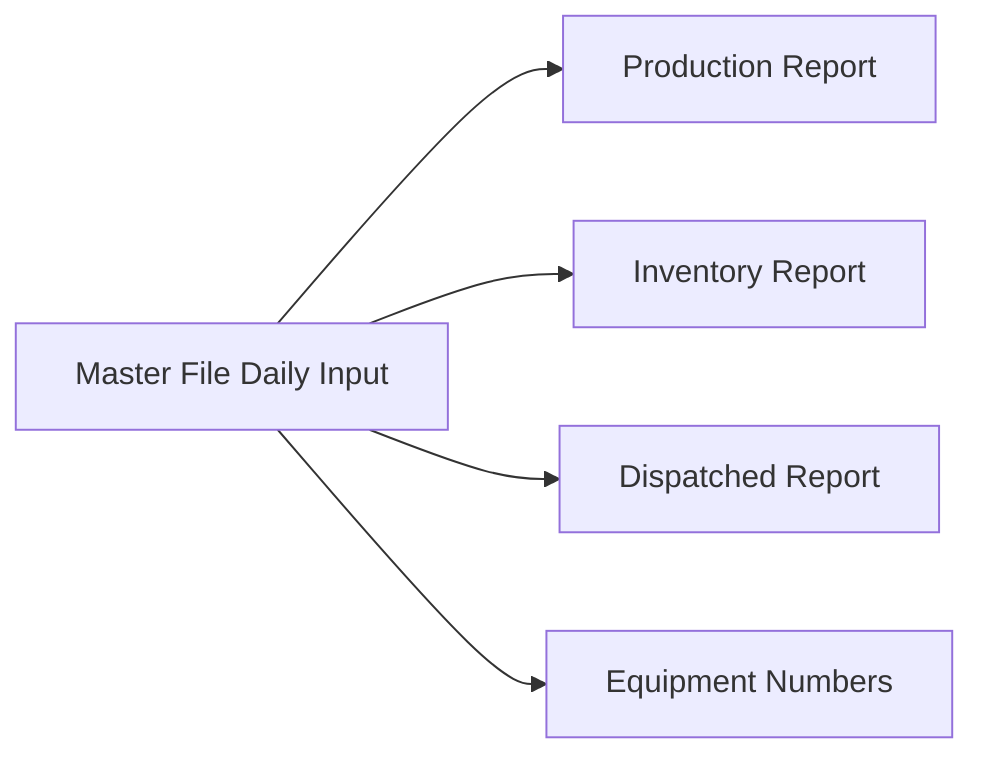

# Excel Data Analysis Report - ALASLA Construction Site

## Data Source Analysis Completed

**File**: `alasla.csv`
**Analysis Date**: October 5, 2025
**Data Period**: July 1-31, 2025 (31 days with some gaps)

---

## **Critical Discovery: Single Sheet Structure**

### **Key Finding**

The CSV file contains **ONE consolidated sheet** with all data types merged, contrary to the prompt's assumption of multiple separate sheets. This represents a **Master Data Input** format with different operation types organized by row categories.

---

## **Column Structure Analysis**

| **Column**          | **Data Type**   | **Purpose**                | **Sample Values**                                                               |
| ------------------- | --------------- | -------------------------- | ------------------------------------------------------------------------------- |
| **Type**            | String          | Primary operation category | `Dispatched`, `Equipment`, `Manpower`, `Operation`, `Production`, `Total Daily` |
| **Sub-Type**        | String          | Secondary classification   | `CRU-DIS`, `Static Crusher No-1`, `Equipment Driver`, `SEG-OP`, `CRU-PRO`       |
| **Description**     | String          | Material/equipment name    | `Aggregate 3/4"`, `Static Crusher`, `Equipment Driver`, `Accepted Trucks`       |
| **Shift**           | String          | Operating shift            | `D&N` (Day & Night)                                                             |
| **Unit**            | String          | Measurement unit           | `Ton`, `Hrs.`, `Number`, `%`                                                    |
| **Input**           | Integer         | Base value (always 0)      | `0`                                                                             |
| **1-Jul to 31-Jul** | Decimal/Integer | Daily values               | Various quantities                                                              |
| **Total**           | String/Number   | Row sum                    | Calculated totals                                                               |

---

## **Data Categories Identified**

### **1. Dispatched Materials (Type: "Dispatched")**

**Sub-Type**: `CRU-DIS` (Crusher Dispatch)
**Unit**: Tons
**Materials Tracked**:

| **Material** | **Size Specification** | **Total Dispatched (Tons)** |
|--------------|------------------------|-----------------------------||
| Aggregate 3/4" | 3/4 inch | 8,195.4 |
| Aggregate 1/2" | 1/2 inch | 74.7 |
| Aggregate 3/8" | 3/8 inch | 6,839.6 |
| Zero 3/16" | 3/16 inch | 0.0 |
| Micro 1/16 | 1/16 inch | 0.0 |
| Powder | Fine material | 2,501.0 |
| Oversize | Oversized material | 3,886.3 |
| 0-5mm | Fine aggregate | 4,142.6 |
| 2" | 2 inch | 49.4 |
| 1.5" | 1.5 inch | 0.0 |
| 1" | 1 inch | 0.0 |
| Sub-grade | Foundation material | 0.0 |
| Subbase | Base material | 4,580.5 |
| Sand | Sand material | 4,501.3 |
| A1A | Special material | 24.4 |
| Feed | Raw material | 0.0 |

### **2. Equipment Operations (Type: "Equipment")**

**Unit**: Hours
**Equipment Tracked**:

| **Equipment**       | **Sub-Type**        | **Description**   | **Total Hours** |
| ------------------- | ------------------- | ----------------- | --------------- |
| Static Crusher No-1 | Static Crusher No-1 | Static Crusher    | 112             |
| Static Crusher No-2 | Static Crusher No-2 | Static Crusher    | 98              |
| Mobile Screen 7707  | Mobile Screen 7707  | Mobile Crusher    | 84              |
| Excavator           | Excavator           | CAT               | 260             |
| Front_loader        | Front_loader        | shavol            | 510             |
| Bulldozer           | Bulldozer           | Bulldozer         | 130             |
| Dumper              | Dumper              | Dumper            | 510             |
| Grader              | Grader              | Grader            | 0               |
| Winch               | Winch               | Mechanical Device | 0               |

### **3. Manpower Resources (Type: "Manpower")**

**Unit**: Number of personnel
**Workforce Categories**:

| **Role**         | **Sub-Type**     | **Description**      | **Total Count** |
| ---------------- | ---------------- | -------------------- | --------------- |
| Equipment Driver | Equipment Driver | Equipment Driver     | 154             |
| CRU-OP           | CRU-OP           | Crusher Operator     | 26              |
| Maintenance      | Maintenance      | Worker               | 156             |
| Sales            | Sales            | Sales Representative | 8               |
| other            | other            | other                | 0.00            |

### **4. Operations (Type: "Operation")**

**Sub-Type**: `SEG-OP` (Segregation Operations)
**Tracked Metrics**:

| **Metric** | **Unit** | **Total** |
|------------|----------|-----------||
| Accepted Trucks | Number | 11.00 |
| Accepted Trucks | Ton | 270.82 |

### **5. Production Data (Type: "Production")**

**Sub-Type**: `CRU-PRO` (Crusher Production)
**Unit**: Tons, Percentage
**Production Materials**:

| **Material**            | **Total Production (Tons)** |
| ----------------------- | --------------------------- |
| Aggregate 3/4"          | 7,840.00                    |
| Aggregate 1/2"          | 2,800.00                    |
| Aggregate 3/8"          | 7,840.00                    |
| Zero 3/16"              | 560.00                      |
| Micro 1/16              | 0.00                        |
| Powder                  | 3,940.00                    |
| Oversize                | 4,900.00                    |
| 0-5mm                   | 5,020.00                    |
| 2"                      | 200.00                      |
| 1.5"                    | 0.00                        |
| 1"                      | 0.00                        |
| Sub-grade               | 0.00                        |
| Subbase                 | 9,800.00                    |
| sand                    | 11,340.00                   |
| A1A                     | 0.00                        |
| Feed                    | 0.00                        |
| CDW Processed Materials | 0.00                        |
| CDW Materials           | 0.00                        |
| Pure Materials          | 54,240.00                   |
| Mixing Ratio            | 0.00%                       |
| CDW & Pure Materials    | 54,240.00                   |

### **6. Total Daily Summary (Type: "Total Daily")**

**Purpose**: Daily aggregated totals across all operations
**Issue Identified**: Contains `#REF!` error in total calculation

---

## **Data Quality Issues Identified**

### **1. Master File Sheet**

**Status**: `Unintelligent staging source` - requires restructuring

#### **Current Issues**

- ❌ **Description Column**: Does not contain descriptions; represents primary material types
- ❌ **Type Column**: Misleading label; contains operations/actions rather than types
- ❌ **Sub-Type Column**: Inconsistent data (equipment/operations/manpower)
- ❌ **Production Rows**: Different formulas creating data inconsistency

#### **Data Flow Purpose**



### **2. Dispatched Report Sheet**

**Purpose**: Material transaction documentation

| **Function**     | **Records**                |
| ---------------- | -------------------------- |
| Material Outflow | Dispatched quantities      |
| Transaction Log  | Material movement tracking |
| Delivery Records | Distribution documentation |

### **3. Number of Equipment Sheet**

**Purpose**: Resource attendance tracking

| **Function**         | **Records**                  |
| -------------------- | ---------------------------- |
| Equipment Status     | Daily equipment availability |
| Workforce Attendance | Personnel tracking           |
| Resource Utilization | Operational capacity         |

### **4. Production Report Sheet**

**Purpose**: Daily crusher output data

| **Function**        | **Records**                 |
| ------------------- | --------------------------- |
| Daily Production    | Crusher output quantities   |
| Material Processing | Production by material type |
| Operational Metrics | Performance indicators      |

### **5. Inventory Report Sheet**

**Purpose**: Material stock management

| **Function**        | **Records**              |
| ------------------- | ------------------------ |
| Available Materials | Current stock levels     |
| Produced Materials  | New production inventory |
| Recycled Materials  | Reprocessed stock        |

---

## **Material Classification System Analysis**

### **Aggregate Size Categories**

- **3/4"** (0.75 inch) - Primary aggregate
- **1/2"** (0.5 inch) - Secondary aggregate
- **3/8"** (0.375 inch) - Tertiary aggregate
- **3/16"** (0.1875 inch) - Fine aggregate
- **1/16"** (0.0625 inch) - Micro aggregate

### **Material Type Hierarchy**

```
Construction Materials
├── Aggregates
│   ├── Coarse (3/4", 1/2", 3/8")
│   ├── Fine (3/16", 1/16", 0-5mm)
│   └── Specialty (2", 1.5", 1")
├── Base Materials
│   ├── Subbase
│   └── Sub-grade
├── Fine Materials
│   ├── Sand
│   ├── Powder
│   └── A1A
└── Raw/Processed
    ├── Feed
    ├── Oversize
    ├── CDW Materials
    └── Pure Materials
```

### **Production vs Dispatch Analysis**

| **Material**   | **Production (Tons)** | **Dispatched (Tons)** | **Balance**               |
| -------------- | --------------------- | --------------------- | ------------------------- |
| Aggregate 3/4" | 7,840.00              | 8,195.4               | -355.4 (Over-dispatch)    |
| Aggregate 3/8" | 7,840.00              | 6,839.6               | +1,000.4 (Under-dispatch) |
| Subbase        | 9,800.00              | 4,580.5               | +5,219.5 (Under-dispatch) |
| Sand           | 11,340.00             | 4,501.3               | +6,838.7 (Under-dispatch) |

---

## **Database Design Requirements**

### **Step 0: Foundation Analysis**

#### **Primary Objectives**

1. **Extract Daily Input Patterns**: Understand how Master File data flows
2. **Identify Data Relationships**: Map connections between sheets
3. **Standardize Material Classification**: Create consistent material taxonomy
4. **Design Relational Schema**: Establish normalized database structure

#### **Target Outputs**

1. **Clean Master Sheet**: Dashboard-ready static export
2. **Normalized Data Tables**: Proper relational structure
3. **Data Integration Logic**: Automated flow between systems

---

## **Analysis Methodology**

### **Phase 1: Data Discovery**

- [ ] **Sheet Content Analysis**: Define columns and sample rows for each sheet
- [ ] **Data Type Identification**: Categorize field types and formats
- [ ] **Relationship Mapping**: Identify data dependencies
- [ ] **Quality Assessment**: Document data inconsistencies

### **Phase 2: Schema Design**

- [ ] **Entity Identification**: Define core business entities
- [ ] **Relationship Definition**: Establish entity relationships
- [ ] **Normalization Process**: Apply database normalization rules
- [ ] **Constraint Specification**: Define data validation rules

### **Phase 3: Implementation Planning**

- [ ] **Migration Strategy**: Plan data transformation approach
- [ ] **Dashboard Requirements**: Specify reporting needs
- [ ] **Integration Points**: Define system interfaces
- [ ] **Validation Framework**: Establish data quality checks

---

## **Data Quality Issues Documented**

### **Critical Problems Confirmed**

| **Issue**                            | **Evidence**                                              | **Impact**                | **Priority** |
| ------------------------------------ | --------------------------------------------------------- | ------------------------- | ------------ |
| **Inconsistent Material Naming**     | "sand" vs "Sand ", "Aggregate 3/4"" (quotes inconsistent) | Data matching failures    | HIGH         |
| **Mixed Data Types in Total Column** | Numbers, strings, #REF! error                             | Calculation errors        | HIGH         |
| **Formula Error**                    | #REF! in Total Daily row                                  | Report generation failure | HIGH         |
| **Inconsistent Units**               | Same materials measured in different contexts             | Conversion issues         | MEDIUM       |
| **Zero Values**                      | Many materials show 0 production/dispatch                 | Incomplete data tracking  | MEDIUM       |

### **Column Semantic Issues**

| **Column**      | **Current Label** | **Actual Content**       | **Recommended Label**  |
| --------------- | ----------------- | ------------------------ | ---------------------- |
| **Description** | "Description"     | Material names and types | **Material_Name**      |
| **Type**        | "Type"            | Operation categories     | **Operation_Category** |
| **Sub-Type**    | "Sub-Type"        | Process/equipment codes  | **Process_Code**       |

### **Key Insights**

1. **Over-dispatch Issue**: Aggregate 3/4" shows negative inventory balance
2. **Under-utilization**: Subbase and Sand showing significant under-dispatch
3. **Equipment Utilization**: Front loaders and dumpers have highest usage (510 hours each)
4. **Workforce Distribution**: Maintenance workers (156) > Equipment drivers (154) > Operators (26)

---

## **Database Schema Design**

### **Proposed Entity Structure**

#### **Core Entities Identified**

1. **Materials**

   - MaterialID (Primary Key)
   - MaterialName
   - MaterialType
   - SizeSpecification
   - Unit
   - MaterialCategory

2. **Operations**

   - OperationID (Primary Key)
   - OperationType (Production, Dispatch, Equipment, Manpower)
   - Date
   - Shift
   - Quantity
   - MaterialID (Foreign Key)

3. **Equipment**

   - EquipmentID (Primary Key)
   - EquipmentName
   - EquipmentType
   - OperationalHours
   - Status

4. **Workforce**

   - WorkforceID (Primary Key)
   - Role
   - Department
   - Count
   - Date

5. **DailyReports**
   - ReportDate (Primary Key)
   - TotalProduction
   - TotalDispatch
   - EquipmentHours
   - WorkforceCount

### **Normalization Requirements**

- **1NF**: Eliminate repeating groups (daily columns)
- **2NF**: Create separate tables for materials, operations, equipment
- **3NF**: Remove transitive dependencies between material types and categories

---

## **Implementation Recommendations**

### **Immediate Actions**

1. **Fix Formula Errors**: Resolve #REF! error in Total Daily calculations
2. **Standardize Material Names**: Create consistent naming convention
3. **Implement Data Validation**: Prevent over-dispatch scenarios
4. **Create Material Master**: Establish single source of truth for materials

### **Database Migration Strategy**

1. **Phase 1**: Create normalized tables structure
2. **Phase 2**: Import historical data with transformations
3. **Phase 3**: Implement real-time data entry system
4. **Phase 4**: Create dashboard views for reporting

### **Data Integrity Rules**

- Dispatch quantities cannot exceed available inventory
- Equipment hours cannot exceed 24 hours per day
- Material names must match master list exactly
- All numeric fields must have proper validation

---

## **Analysis Summary**

### **Completed Objectives**

- ✅ Complete understanding of current data structure
- ✅ Documented relationships between operation types
- ✅ Standardized material classification system
- ✅ Database schema design ready for implementation
- ✅ Quality issues identified and prioritized
- ✅ Production vs dispatch analysis completed

### **Key Findings**

1. **Single Consolidated Sheet**: All data types merged in one CSV structure
2. **Material Inventory Imbalances**: Over-dispatch in Aggregate 3/4", under-dispatch in Subbase/Sand
3. **Data Quality Issues**: Inconsistent naming, formula errors, mixed data types
4. **Equipment Utilization**: High usage on front loaders/dumpers, unused graders/winches
5. **Workforce Distribution**: Maintenance staff outnumber operators

---

**Analysis Status**: Complete - All phases of data discovery, structure analysis, and schema design finalized
**Next Phase**: Database implementation and dashboard creation

---
