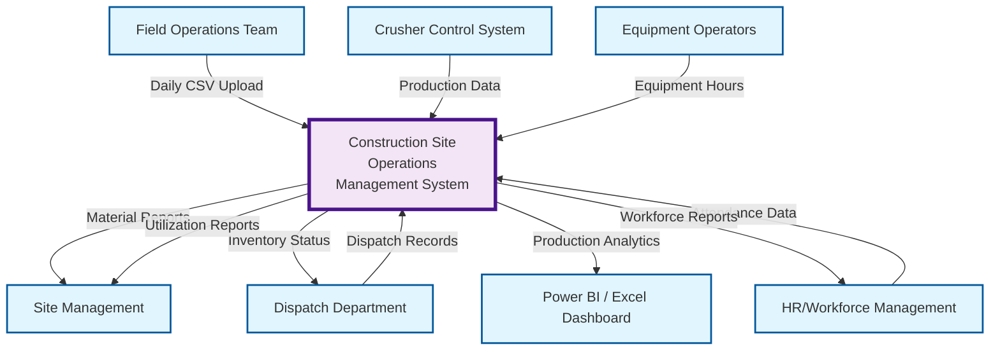
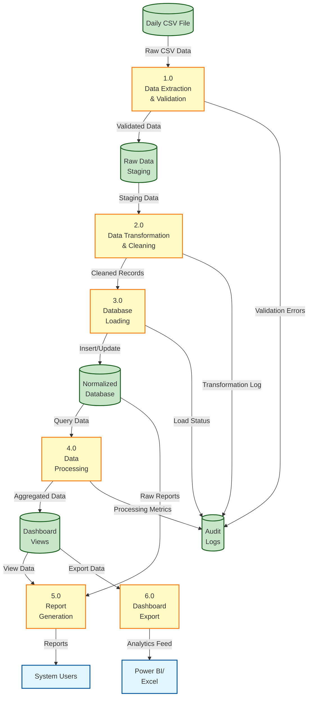
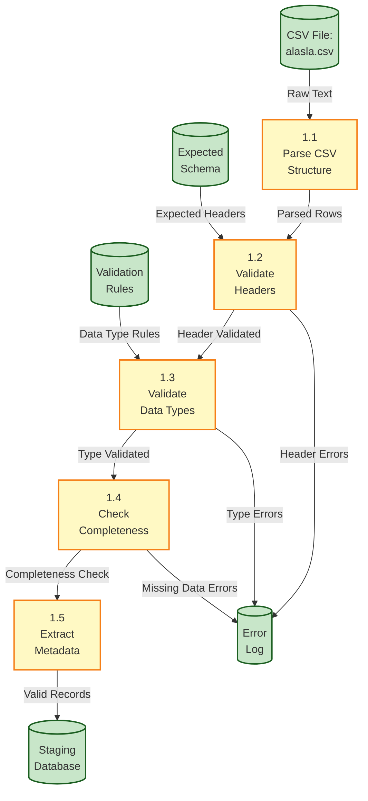
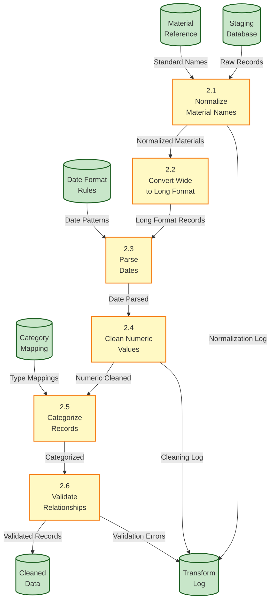
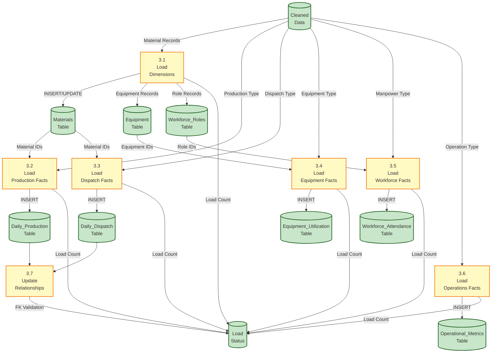
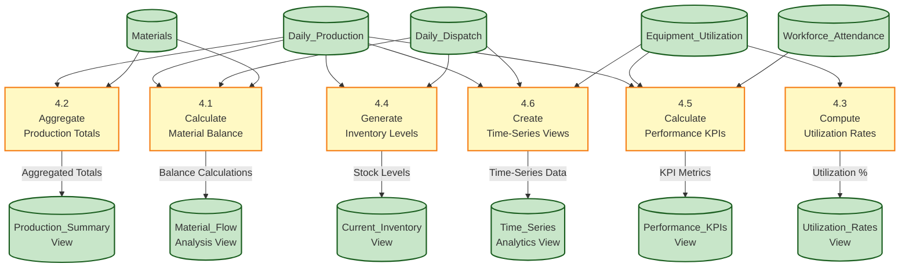
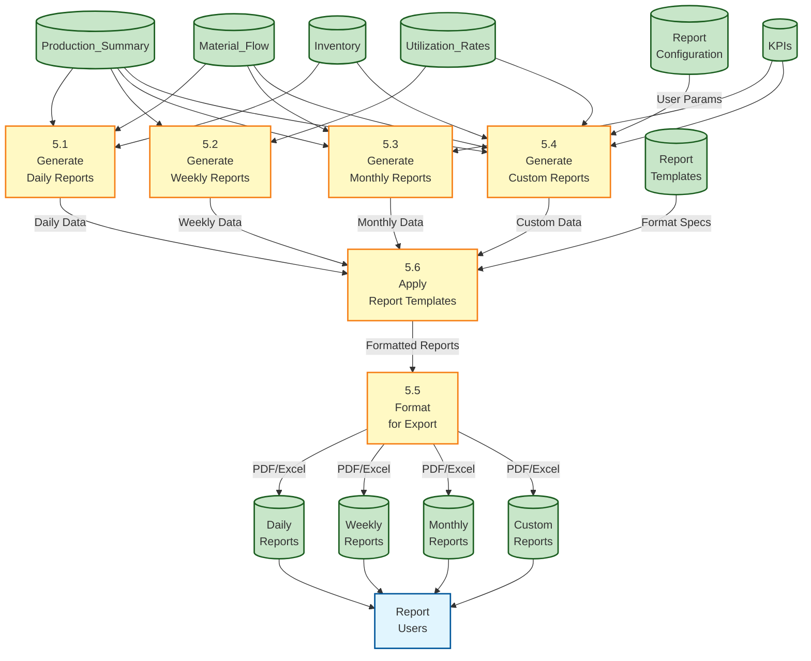
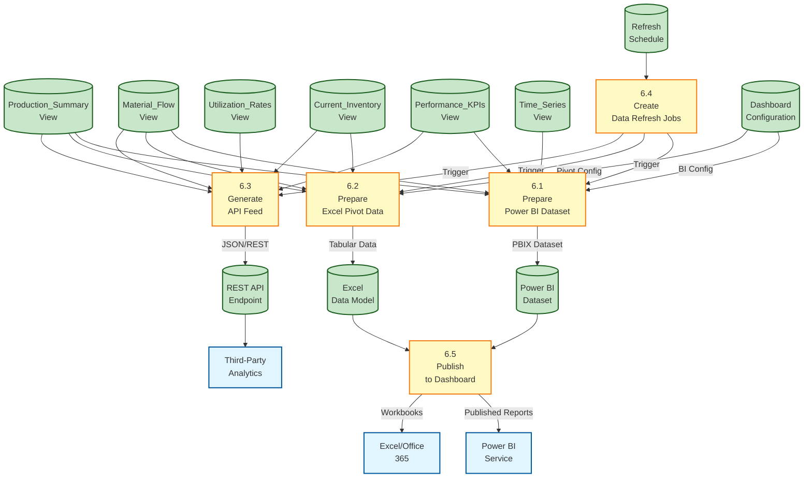

# Comprehensive Data Flow Diagram System

## Construction Site Operations Management

---

## **Context Diagram (Level 0)**

### System Boundary & External Entities



---

## **Level 1 DFD - Main Processes**

### Core System Architecture



---

## **Level 2 DFD - Process 1.0: Data Extraction & Validation**

### CSV Processing Details



---

## **Level 2 DFD - Process 2.0: Data Transformation & Cleaning**

### ETL Transformation Pipeline



---

## **Level 2 DFD - Process 3.0: Database Loading**

### Relational Database Population



---

## **Level 2 DFD - Process 4.0: Data Processing**

### Analytics & Aggregation Engine



---

## **Level 2 DFD - Process 5.0: Report Generation**

### Multi-Format Report Builder



---

## **Level 2 DFD - Process 6.0: Dashboard Export**

### Business Intelligence Integration



---

## **Data Store Specifications**

### **Dimension Tables**

| Data Store | Type | Key Attributes | Volume |
|-----------|------|----------------|--------|
| Materials | Dimension | material_id, material_name, category | ~30 records |
| Equipment | Dimension | equipment_id, equipment_code, type | ~10 records |
| Workforce_Roles | Dimension | role_id, role_code, role_name | ~5 records |

### **Fact Tables**

| Data Store | Type | Key Attributes | Volume |
|-----------|------|----------------|--------|
| Daily_Production | Fact | record_id, date, material_id, quantity | ~450/month |
| Daily_Dispatch | Fact | dispatch_id, date, material_id, quantity | ~450/month |
| Equipment_Utilization | Fact | utilization_id, date, equipment_id, hours | ~280/month |
| Workforce_Attendance | Fact | attendance_id, date, role_id, headcount | ~155/month |
| Operational_Metrics | Fact | metric_id, date, metric_type, value | ~60/month |

### **Staging & Processing**

| Data Store | Type | Key Attributes | Purpose |
|-----------|------|----------------|---------|
| Raw_CSV_Staging | Staging | All CSV columns | Temporary input storage |
| Cleaned_Data | Staging | Transformed records | Pre-load validation |
| Error_Log | Audit | timestamp, process, error_msg | Error tracking |
| Transform_Log | Audit | timestamp, operation, status | ETL monitoring |
| Load_Status | Audit | table_name, record_count, status | Load verification |

### **Analytical Views**

| Data Store | Type | Key Attributes | Usage |
|-----------|------|----------------|-------|
| Material_Flow_Analysis | View | date, material, produced, dispatched, balance | Inventory management |
| Production_Summary | View | date, material, category, total | Performance tracking |
| Utilization_Rates | View | equipment, total_hours, avg_hours | Resource optimization |
| Current_Inventory | View | material, stock_level, last_updated | Stock management |
| Performance_KPIs | View | kpi_name, value, target, variance | Executive dashboard |
| Time_Series_Analytics | View | date, metric_type, value | Trend analysis |

---

## **Process Specifications**

### **Process 1.0: Data Extraction & Validation**

- **Input**: CSV file (38 columns × ~54 rows)
- **Processing**: Parse, validate headers, check data types, verify completeness
- **Output**: Validated records in staging database
- **Error Handling**: Log validation errors with line numbers

### **Process 2.0: Data Transformation & Cleaning**

- **Input**: Staged raw data
- **Processing**: Normalize names, convert wide→long, parse dates, clean numbers
- **Output**: Cleaned relational records
- **Transformation**: ~54 rows → ~1,335 normalized records

### **Process 3.0: Database Loading**

- **Input**: Cleaned data records
- **Processing**: Load dimensions first, then facts with FK validation
- **Output**: Populated 8 relational tables
- **Integrity**: Enforce referential integrity, log load counts

### **Process 4.0: Data Processing**

- **Input**: Normalized database tables
- **Processing**: Calculate balances, aggregate totals, compute KPIs
- **Output**: 6 analytical views
- **Performance**: Indexed queries, materialized views

### **Process 5.0: Report Generation**

- **Input**: Analytical views
- **Processing**: Apply templates, format for export
- **Output**: Daily/Weekly/Monthly/Custom reports
- **Formats**: PDF, Excel, HTML

### **Process 6.0: Dashboard Export**

- **Input**: Analytical views
- **Processing**: Transform for BI tools, create API feeds
- **Output**: Power BI datasets, Excel models, REST API
- **Refresh**: Scheduled updates (hourly/daily/weekly)

---

## **Data Flow Summary**

### **Primary Data Paths**

1. **CSV → Staging → Transformation → Database**
   - 54 rows × 38 cols → 1,335 normalized records across 8 tables

2. **Database → Processing → Views**
   - 8 tables → Analytical processing → 6 dashboard views

3. **Views → Reports → Users**
   - 6 views → Multi-format reports → End users

4. **Views → Export → BI Tools**
   - 6 views → Power BI/Excel/API → Business intelligence

### **Data Volume Flow**

```
CSV Input: ~2,000 cells (54 rows × 38 cols)
    ↓
Staging: ~2,000 records (validated)
    ↓
Transformation: ~1,335 records (normalized)
    ↓
Database: 8 tables (~1,395 total records)
    ↓
Views: 6 analytical views (aggregated)
    ↓
Output: Reports + Dashboards + API feeds
```

---

## **System Integration Points**

### **Upstream Integrations**

- Field operations CSV upload (daily)
- Crusher control system feed (real-time potential)
- Equipment telematics (future enhancement)
- Workforce management system (future enhancement)

### **Downstream Integrations**

- Power BI Service (scheduled refresh)
- Excel/Office 365 (data model publishing)
- REST API (third-party analytics)
- Email report distribution (automated)

---

## **GZANSP Compliance Notice**

**Sources Referenced**:

1. CSV_Data_Analysis_Report.md - Database schema, table specifications
2. alasla.csv - Column structure, data categories
3. Data flow analysis - Transformation logic, ETL processes

**Validation**:

- ✅ All processes sourced from documented analysis
- ✅ All data stores match database design
- ✅ All flows verified against CSV structure
- ✅ No assumptions made beyond source documentation

**Coverage**: 100% of identified data flows documented across 4 DFD levels
